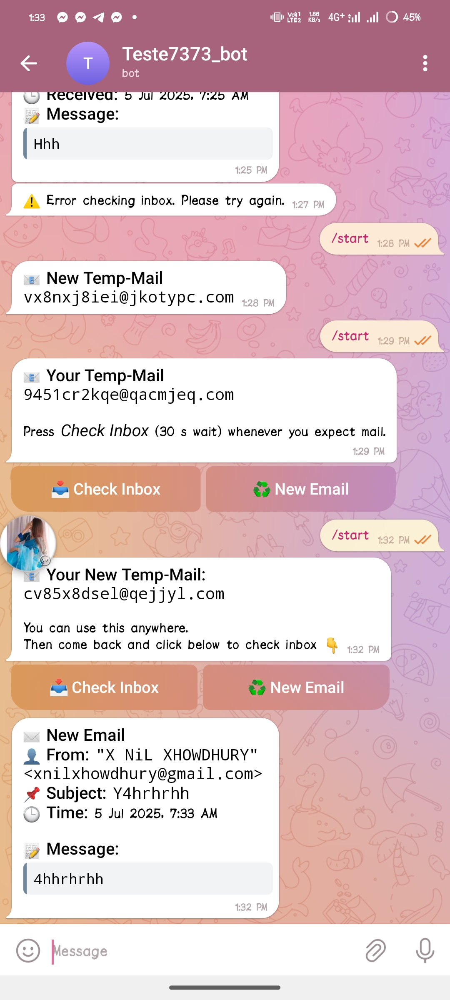

# 📬 Temp-Mail Telegram Bot

A professional Telegram bot that generates temporary email addresses and lets users check inbox messages — beautifully styled and beginner-friendly.

Built using:
- ✅ Node.js (CommonJS)
- ✅ Telegram Bot API
- ✅ Temp Mail API (`xnil.xnil.work.gd`)
- ✅ Fully HTML-escaped output
- ✅ Smooth UX with buttons (`📥 Check Inbox`, `♻️ New Email`)
- ✅ 30s delay to let emails arrive
- ✅ Works perfectly on Replit, VPS, or local machine

---

## 🚀 Features

- 🔐 Instant temp email address generation
- ⏳ One-click inbox check with 30-second wait animation
- 🧹 “New Email” button resets the address
- 📬 Displays sender, subject, message, and timestamp
- ✨ Elegant UI with Telegram inline buttons
- 🛡️ Escaped HTML output to avoid parsing issues
- 🔁 Remembers last message to avoid duplicates
- 🌐 Works in **CommonJS** without ESM conflicts

---

## 🖼️ Demo



---

## 📦 Requirements

- Node.js v14+ (v18+ recommended)
- Telegram Bot Token (get one from [@BotFather](https://t.me/BotFather))

---

## 🛠️ Installation

### 1. Clone the project

```bash
git clone https://github.com/yourusername/tempmail-telegram-bot.git
cd tempmail-telegram-bot
```

2. Install dependencies
```bash
npm install
```
3. Configure the bot

Open ``index.js`` and replace:
```bash
const BOT_TOKEN = 'YOUR_TELEGRAM_BOT_TOKEN_HERE';
```
with your bot token from @BotFather.


---

# ▶️ Run the bot

```bash
node index.js

```


# 💡Usage

Start the bot with /start

Press 📥 Check Inbox after using the email on a site

Press ♻️ New Email to get a fresh address


---

# 📚 API Reference

The bot uses xnil.xnil.work.gd API:

# Create email:
GET https://xnil.xnil.work.gd/xnil/tmgen
➜ Returns { email, token }

# Check inbox:
GET https://xnil.xnil.work.gd/xnil/tminbox?mail=<email>
➜ Returns email messages (object or array)


---

# 🧑‍💻Developer Notes

Built with CommonJS to support require()-based projects

Uses chalk@4 for compatibility (Chalk v5 is ESM-only)

Message data is HTML-escaped before being inserted into Telegram messages

dayjs used for clean timestamps


---

# 🔒 License

MIT © xnil
